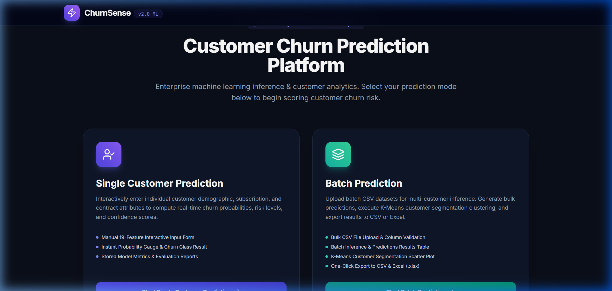
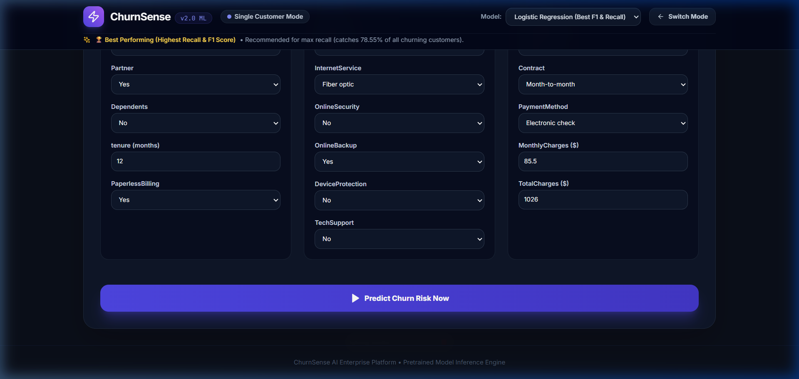
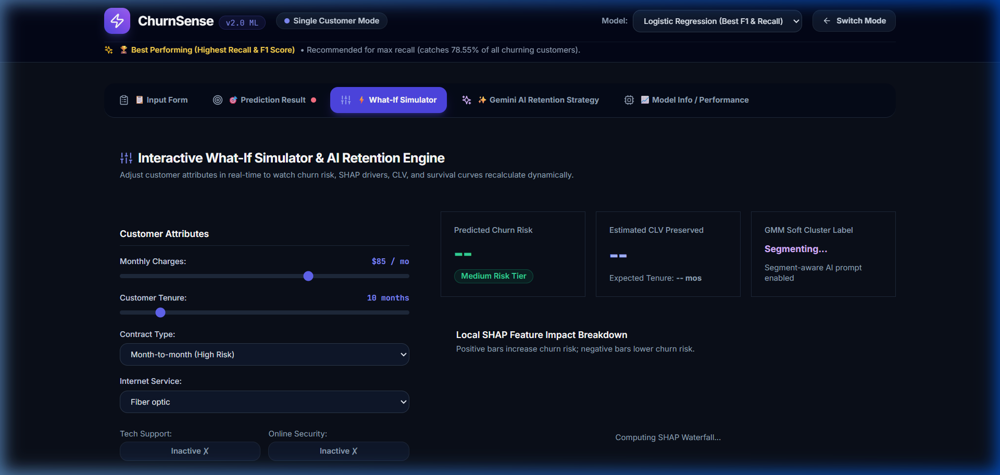
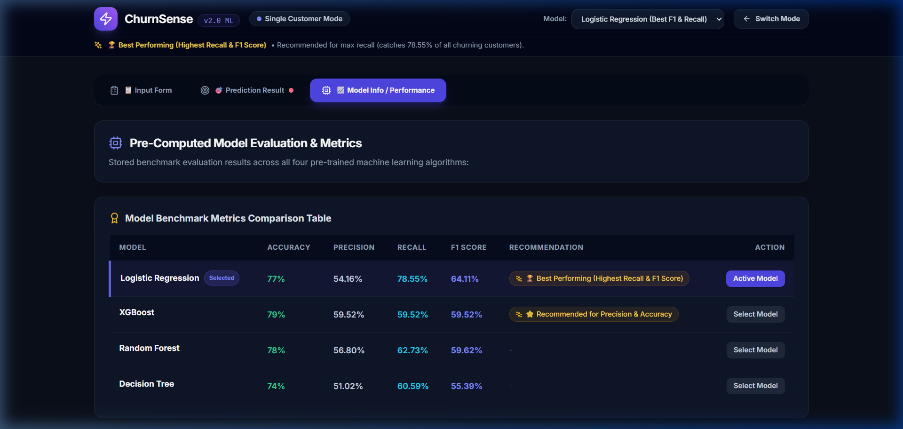

# ⚡ ChurnSense AI — Customer Churn & Retention Intelligence Platform

[](https://fastapi.tiangolo.com/)
[](https://reactjs.org/)
[](https://vitejs.dev/)
[](https://tailwindcss.com/)
[](https://www.python.org/)
[](https://ai.google.dev/)

**ChurnSense AI** is a full-stack Machine Learning & Generative AI web platform designed for customer churn prediction, interactive What-If scenario simulation, customer segmentation, and Gemini AI retention strategy generation.

---

## 🖼 Application Screenshots

### 1. Landing Page (Mode Selection)
Mode selection landing interface with **zero pre-loaded default data**, allowing users to choose between **Single Customer Prediction** and **Batch Prediction**.



---

### 2. Single Customer Prediction & Risk Gauge Dashboard
19-feature input form with real-time churn risk prediction, risk tier level assignment, and confidence gauge.




---

### 3. Interactive What-If Scenario Simulator
Real-time sliders for Monthly Charges, Tenure, Contract Type, TechSupport, and OnlineSecurity with live SHAP feature driver waterfall plots.



---

### 4. Gemini Segment-Aware AI Retention Strategies & Promo Coupons
Generates personalized customer retention playbooks, intervention cost breakdowns, campaign ROI (+%), and custom promo coupons (e.g. `SAVE-HIGH-RISK-984`) incorporating customer call notes and prompt details.


---

### 5. Batch Scoring & 1-Click Sample CSV Dataset Loader
Upload batch customer `.csv` files for bulk churn scoring, risk tier assignment, and exported predictions. Includes a **Download Sample CSV** button and a **Use Sample Dataset (25 Rows)** 1-click test loader.


---

### 6. Multi-Model ML Benchmark & Model Comparison
Interactive model comparison evaluating **Logistic Regression** (*Best Recall: 78.55%*), **XGBoost** (*Best Accuracy: 79.00%*), **Random Forest**, and **Decision Tree** with pre-computed metrics tables, confusion matrices, and classification reports.



---

## 🚀 Quick Start Instructions

### 1. ML Model Pipeline Setup
```bash
python ml_pipeline/train_pipeline.py
```

### 2. Start FastAPI Backend (Port 8000)
```bash
python backend/main.py
```
- Interactive API Docs: `http://127.0.0.1:8000/docs`

### 3. Start React SPA Frontend (Port 3000)
```bash
cd frontend
npm install
npm run dev
```
- Application Interface: `http://localhost:3000`

### 4. Optional Streamlit Demo
```bash
streamlit run app.py
```
- Streamlit Interface: `http://localhost:8501`

---

## 🔌 Core API Endpoints

| Method | Endpoint | Description |
| :--- | :--- | :--- |
| `GET` | `/` | Health check & API version status |
| `POST` | `/api/v1/predict` | Single customer churn prediction & SHAP drivers |
| `POST` | `/api/v1/batch-predict` | Upload CSV for bulk churn risk classification & predictions |
| `POST` | `/api/v1/ai-strategy` | Generate segment-aware Gemini retention strategy & promo coupon |
| `GET` | `/api/v1/clusters` | 2D PCA projection coordinates & cluster elbow metrics |
| `GET` | `/api/v1/model-insights` | Model metrics comparison & SHAP feature importances |

---

## 🔑 Gemini API Key Configuration

To enable live Google Gemini AI strategy generation:
```powershell
$env:GEMINI_API_KEY="your_google_gemini_api_key_here"
```
*(Automatic template fallback is used if no API key is provided).*
