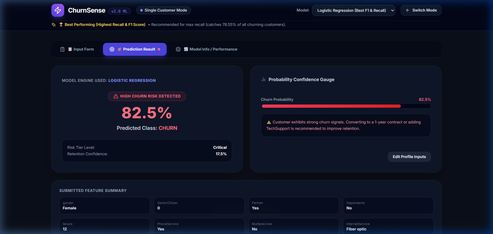
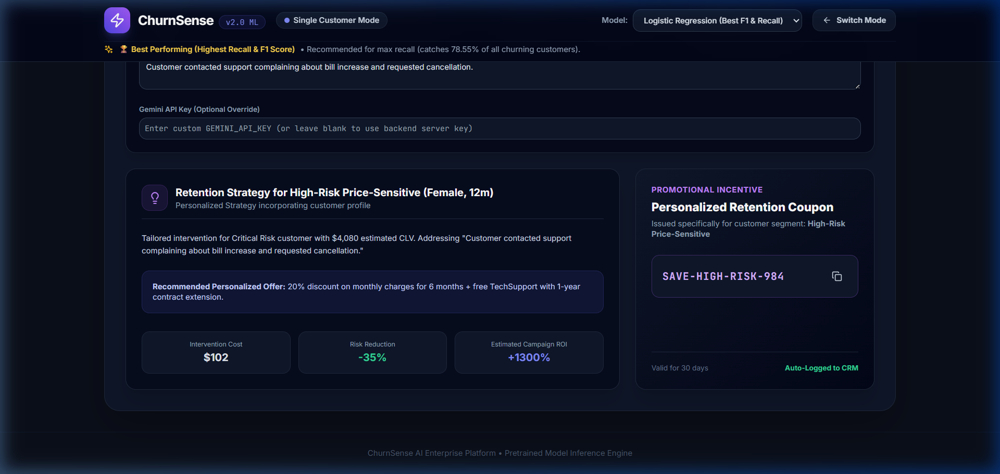
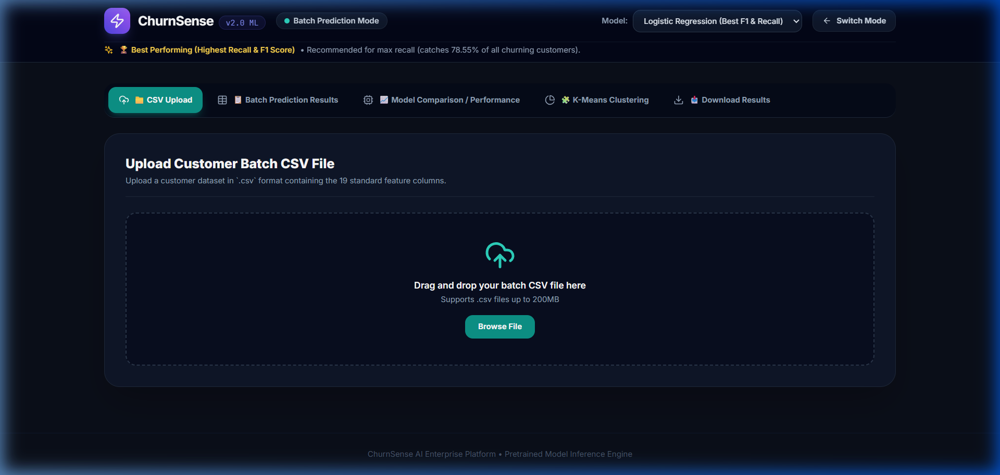

# ⚡ ChurnSense AI — Enterprise Customer Churn & Retention Intelligence Platform

[](https://fastapi.tiangolo.com/)
[](https://reactjs.org/)
[](https://vitejs.dev/)
[](https://tailwindcss.com/)
[](https://www.python.org/)
[](https://ai.google.dev/)

**ChurnSense AI** is a production-ready, full-stack Machine Learning & Generative AI platform engineered to predict customer churn, segment user profiles, run survival/CLV analysis, monitor data drift, and generate personalized, AI-driven retention strategies with custom promo coupons.

---

## 🖼 Application Screenshots & Feature Highlights

### 1. Landing Page — Mode Selection
Modern dark-themed landing interface with **zero pre-loaded default data**, allowing users to choose between **Single Customer Prediction** and **Batch Prediction**.


---

### 2. Single Customer Prediction & 19-Feature Input Form
Complete 19-feature customer input form with real-time churn probability scoring, risk tier level assignment, and confidence gauges.




---

### 3. Interactive What-If Scenario Simulator
Allows retention managers to adjust monthly charges, tenure, contract types, and tech support add-ons in real time to observe dynamic churn risk recalculation and local SHAP feature drivers.


---

### 4. Gemini Segment-Aware AI Retention Strategies & Promo Coupons
Integrates Google Gemini AI to generate personalized customer retention playbooks, intervention cost breakdowns, campaign ROI (+%), and custom promotional discount coupon codes (e.g. `SAVE-HIGH-RISK-984`). Incorporates full customer call notes and prompt details.



---

### 5. Batch Scoring & 1-Click Sample CSV Loading
Upload batch customer `.csv` files for bulk churn scoring, risk tier assignment, and instant exported predictions. Includes a **Download Sample CSV** button and a **Use Sample Dataset (25 Rows)** 1-click test loader.



---

### 6. Multi-Model ML Benchmark & Model Comparison
Interactive model comparison switcher evaluating **Logistic Regression** (*Best Recall: 78.55%*), **XGBoost** (*Best Accuracy: 79.00%*), **Random Forest**, and **Decision Tree** with pre-computed metric badges, confusion matrices, and classification reports.


---

## 📑 Table of Contents

- [Application Screenshots & Feature Highlights](#-application-screenshots--feature-highlights)
- [Key Features](#-key-features)
- [System Architecture](#-system-architecture)
- [Project Directory Structure](#-project-directory-structure)
- [Tech Stack](#-tech-stack)
- [Prerequisites](#-prerequisites)
- [Installation & Setup](#-installation--setup)
- [How to Run the Application](#-how-to-run-the-application)
- [API Endpoints Reference](#-api-endpoints-reference)
- [Environment Variables](#-environment-variables)
- [License & Support](#-license--support)

---

## ✨ Key Features

1. **Multi-Model Machine Learning Engine**:
   - Pre-trained models: **Logistic Regression** (Recommended for Recall/F1), **XGBoost** (Recommended for Accuracy/Precision), **Random Forest**, and **Decision Tree**.
   - Expandable confusion matrices (`TN`, `FP`, `FN`, `TP`) and classification reports per model.

2. **Conditional Mode Navigation**:
   - **Single Customer Prediction Mode**: Access Input Form, Prediction Result, What-If Simulator, Gemini AI Strategy, and Model Info. (K-Means Clustering is hidden in single mode).
   - **Batch Prediction Mode**: Full access to CSV Upload, Batch Results, Model Comparison, K-Means Clustering, What-If Simulator, Gemini AI Strategy, and CSV/Excel Export.

3. **Interactive What-If Scenario Simulator**:
   - Real-time sliders for Monthly Charges, Tenure, Contract Type, TechSupport, and OnlineSecurity with live SHAP feature driver waterfall plots.

4. **Gemini Segment-Aware AI Retention Engine**:
   - Generates tailored retention playbooks, recommended interaction channels, promotional discount coupons (`SAVE-HIGH-RISK-984`), intervention costs ($), risk reduction (-%), and campaign ROI (+%).
   - Supports custom customer call notes and prompt parameters.

5. **Customer Segmentation & K-Means 2D PCA Clustering**:
   - Data-driven customer segmentation (`High-Risk Price-Sensitive`, `Stable High-Value`, `New & Vulnerable`, `Loyal Low-Engagement`) with interactive 2D PCA scatter plots and Elbow/Silhouette diagnostics.

6. **Batch Scoring & Sample CSV Integration**:
   - Instant 1-click **Use Sample Dataset (25 Rows)** loader and **Download Sample CSV** template file button.

---

## 🏗 System Architecture

```
                                  +---------------------------------------+
                                  |    React SPA Frontend (Vite/Tailwind) |
                                  |    http://localhost:3000              |
                                  +-------------------+-------------------+
                                                      |
                                                      | HTTP / Axios Requests
                                                      v
                                  +---------------------------------------+
                                  |    FastAPI REST Backend               |
                                  |    http://127.0.0.1:8000              |
                                  +---------+-------------------+---------+
                                            |                   |
                     +----------------------+                   +---------------------+
                     |                                                                |
                     v                                                                v
   +------------------------------------+                           +-----------------------------------+
   |   Trained ML Artifacts             |                           |   Google Gemini AI Service        |
   |   (XGBoost, RF, GMM, Cox, SHAP)    |                           |   Automated Retention Strategies  |
   +------------------------------------+                           +-----------------------------------+
```

---

## 📁 Project Directory Structure

```
Customer_Churn/
├── README.md                           # Main Project Documentation
├── screenshots/                        # Application Screenshots
│   ├── landing_page.png
│   ├── single_customer_input.png
│   ├── prediction_result.png
│   ├── what_if_simulator.png
│   ├── gemini_ai_strategy.png
│   ├── batch_scoring.png
│   └── model_comparison.png
│
└── Curstomer_churn_project/
    ├── requirements.txt                # Python backend & ML dependencies
    ├── app.py                          # Streamlit demo application
    ├── sample_customer_churn_batch.csv # Sample CSV dataset (25 rows)
    ├── customer_churn_dataset-training-master.csv # Master training dataset
    │
    ├── backend/                        # FastAPI Enterprise Backend
    │   ├── main.py                     # FastAPI entry point & CORS configuration
    │   ├── api/
    │   │   └── router.py               # API route definitions
    │   ├── services/
    │   │   ├── model_manager.py        # ML artifact loader & preprocessing
    │   │   ├── prediction_service.py   # Prediction & SHAP calculation logic
    │   │   └── gemini_service.py       # Google Gemini AI strategy generator
    │   └── models/                     # Saved binary models (.pkl)
    │       ├── model_xgboost.pkl
    │       ├── model_random_forest.pkl
    │       ├── model_decision_tree.pkl
    │       ├── model_logistic_regression.pkl
    │       └── encoders.pkl
    │
    ├── frontend/                       # React 18 + Vite + Tailwind CSS SPA
    │   ├── public/
    │   │   └── sample_customer_churn_batch.csv # Downloadable sample CSV
    │   ├── src/
    │   │   ├── App.jsx                 # Main mode router & application state
    │   │   └── components/
    │   │       ├── LandingPage.jsx     # Landing page with Single vs Batch options
    │   │       ├── HeaderNav.jsx       # Header bar with mode switcher & model selector
    │   │       ├── SingleCustomerPrediction.jsx # Single customer prediction tab container
    │   │       ├── BatchPrediction.jsx # Batch scoring & export tab container
    │   │       ├── WhatIfSimulator.jsx # Real-time interactive scenario simulator
    │   │       ├── AiStrategies.jsx    # Gemini AI retention strategy generator
    │   │       ├── CustomerClustering.jsx # Recharts 2D PCA K-Means cluster scatter plot
    │   │       └── ModelPerformance.jsx# Model metrics comparison & confusion matrices
    │
    └── ml_pipeline/                    # Machine Learning Pipeline
        └── train_pipeline.py           # ML training script
```

---

## 🛠 Tech Stack

| Layer | Technology | Usage |
| :--- | :--- | :--- |
| **Frontend Framework** | **React 18**, **Vite** | Single Page Application framework & dev server |
| **Styling & UI** | **Tailwind CSS**, **Lucide Icons** | Modern dark-mode UI styling & icons |
| **Data Visualization** | **Recharts** | Interactive 2D PCA scatter plots, line charts & gauges |
| **Backend API** | **FastAPI**, **Uvicorn** | High-performance asynchronous Python REST API |
| **Machine Learning** | **XGBoost**, **Scikit-Learn** | Pre-trained churn models & encoders |
| **Generative AI** | **Google Gemini API** | Segment-aware retention strategies & promo generation |
| **Data Processing** | **Pandas**, **NumPy** | Batch scoring & data transformations |

---

## 🚀 How to Run the Application

### Step 1: Clone & Navigate to Project

```bash
cd d:\Customer_Churn\Curstomer_churn_project
```

### Step 2: Set Up Python Backend Environment

```bash
# Activate virtual environment
python -m venv venv
.\venv\Scripts\Activate.ps1   # On Windows

# Install Python dependencies
pip install -r requirements.txt
```

### Step 3: Start FastAPI Backend Server (Port 8000)

```bash
python backend/main.py
```
- **Backend Swagger Docs**: `http://127.0.0.1:8000/docs`

### Step 4: Start React SPA Frontend (Port 3000)

In a new terminal window:
```bash
cd frontend
npm install
npm run dev
```
- **React Web App UI**: `http://localhost:3000` (or `http://localhost:5173`)

---

## 🔌 API Endpoints Reference

| Method | Endpoint | Description |
| :--- | :--- | :--- |
| `GET` | `/` | Health check & API version status |
| `POST` | `/api/v1/predict` | Single customer prediction, risk tier, GMM cluster & SHAP drivers |
| `POST` | `/api/v1/batch-predict` | Batch CSV churn scoring & predictions |
| `POST` | `/api/v1/ai-strategy` | Generate segment-aware Gemini retention strategy & promo coupon |
| `GET` | `/api/v1/clusters` | 2D PCA projection coordinates & cluster elbow metrics |
| `GET` | `/api/v1/model-insights` | Pre-computed model benchmarks & SHAP feature importances |

---

## 🔑 Environment Variables

Set your `GEMINI_API_KEY` to enable live Google Gemini AI strategy generation:

```powershell
$env:GEMINI_API_KEY="your_google_gemini_api_key_here"
```

*(If blank, the system automatically uses template-based AI retention strategies).*

---

## 📄 License & Credits

Built as an enterprise-grade customer churn analytics platform with Multi-Model Machine Learning, What-If Simulation, and Google Gemini AI Retention Strategies.